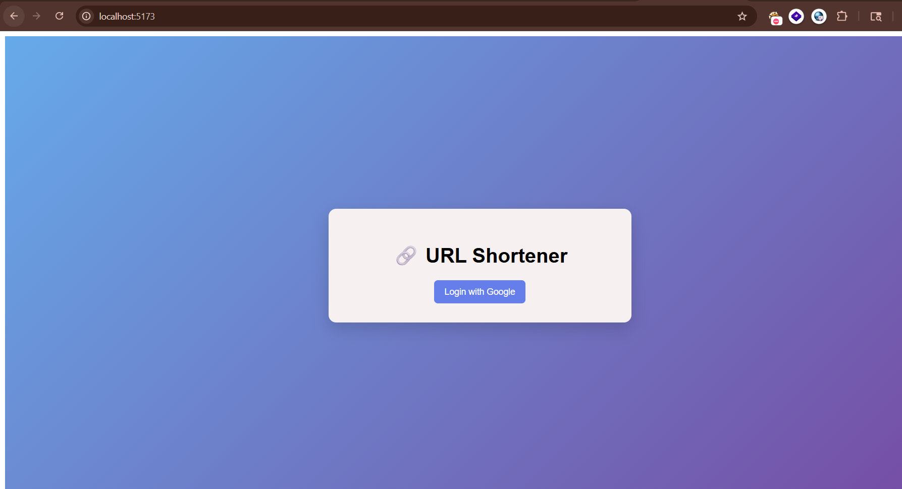
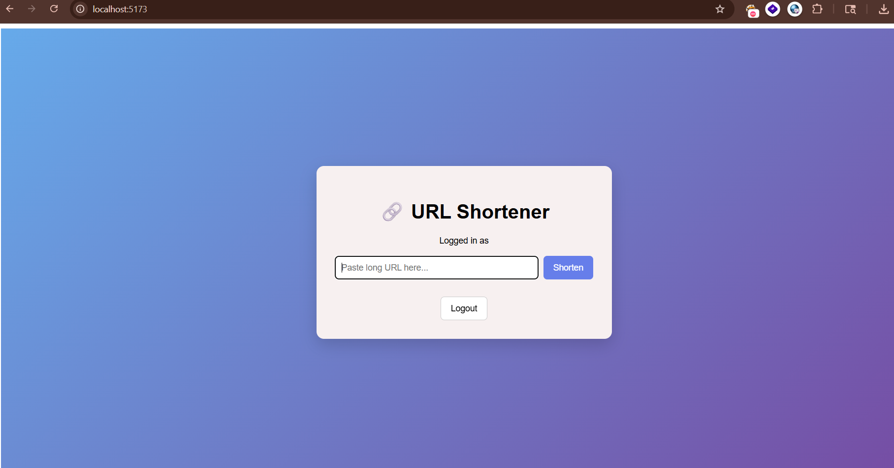
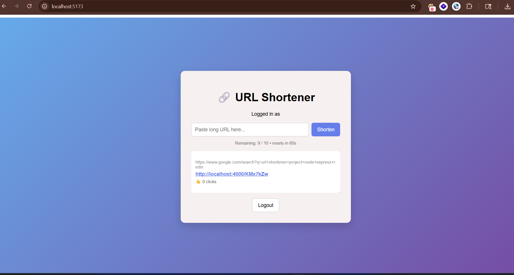

# URL Shortener

A full-stack URL shortening service built with Node.js, Express, PostgreSQL, and Redis.  
Users authenticate via Google OAuth and can shorten URLs, track click counts, and benefit from Redis-powered caching and rate limiting.

---
## Live Demo

https://url-shortener-redis.vercel.app

---
## Screenshots

### Login Page


### Dashboard


### Shortened URL


---

## Features

- Shorten long URLs into 7-character links
- Google OAuth authentication
- Redis caching for fast redirects
- Rate limiting:
  - 10 requests/min (logged in)
  - 5 requests/min (anonymous)
- Click tracking
- User dashboard
- Rate limit headers (X-RateLimit-Limit, X-RateLimit-Remaining, X-RateLimit-Reset)

---

## Tech Stack

- Backend: Node.js, Express
- Frontend: React (Vite)
- Database: PostgreSQL (Neon)
- Cache & Rate Limiting: Redis (Upstash)
- ORM: Prisma
- Authentication: Google OAuth (Passport.js)

---

## How It Works

### URL Shortening
- POST `/api/shorten`
- Generates a unique 7-character code using nanoid
- Stores in PostgreSQL and returns short URL

### Redirect Flow
- Checks Redis cache first
- If cache hit → instant redirect
- If miss → fetch from PostgreSQL → cache (24h TTL) → increment click count → redirect

### Rate Limiting
- Redis counter per user ID or IP
- Resets every 60 seconds
- Exceeding limit returns HTTP 429

---

## Project Structure

```
url-shortener/
├── backend/
│   ├── prisma/
│   │   └── schema.prisma
│   ├── src/
│   │   ├── auth.js
│   │   ├── prisma.js
│   │   ├── rateLimit.js
│   │   ├── redis.js
│   │   └── server.js
│   └── package.json
├── frontend/
│   ├── src/
│   │   └── App.jsx
│   └── package.json
└── README.md
```

---

## API Endpoints

| Method | Endpoint       | Description                  | Auth |
|--------|---------------|------------------------------|------|
| POST   | /api/shorten  | Create a short URL           | Yes  |
| GET    | /api/urls     | Get all user URLs            | Yes  |
| GET    | /:code        | Redirect to original URL     | No   |
| GET    | /me           | Get current user             | No   |
| POST   | /logout       | Logout user                  | Yes  |

---

## Local Setup

### Prerequisites

- Node.js v18+
- Neon (PostgreSQL)
- Upstash (Redis)
- Google Cloud account

---

### Step 1 — Clone

```bash
git clone https://github.com/awanishyadav967/url-shortener.git
cd url-shortener
```

---

### Step 2 — Environment Variables

Create `.env` inside `backend/`:

```
DATABASE_URL=your_neon_postgresql_connection_string
UPSTASH_REDIS_REST_URL=your_upstash_redis_rest_url
UPSTASH_REDIS_REST_TOKEN=your_upstash_redis_rest_token
SESSION_SECRET=any_random_string
GOOGLE_CLIENT_ID=your_google_oauth_client_id
GOOGLE_CLIENT_SECRET=your_google_oauth_client_secret
GOOGLE_CALLBACK_URL=http://localhost:4000/auth/google/callback
```

---

### Step 3 — Install Dependencies

```bash
cd backend && npm install
cd ../frontend && npm install
```

---

### Step 4 — Database Setup

```bash
cd backend
npx prisma db push
npx prisma generate
```

---

### Step 5 — Run Application

```bash
# backend
npm run dev

# frontend
npm run dev
```

Open: http://localhost:5173

---

## Future Improvements

- Custom aliases for URLs
- Analytics dashboard
- Link expiration
- QR code generation
- Distributed rate limiting


